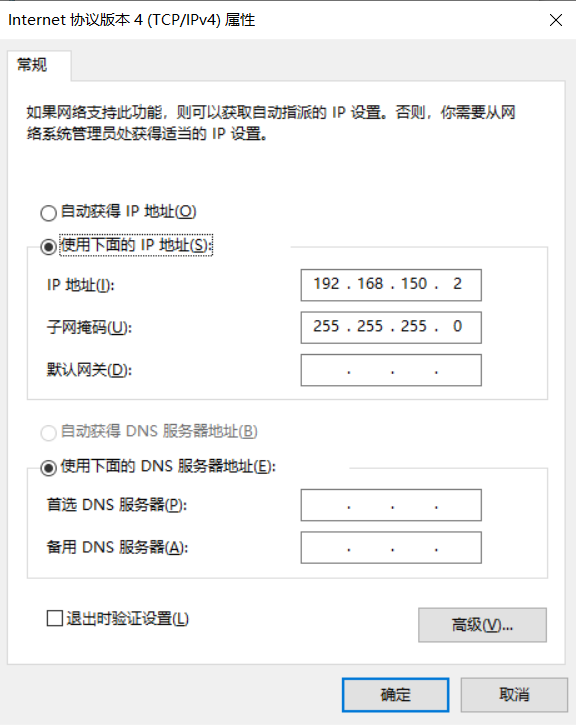
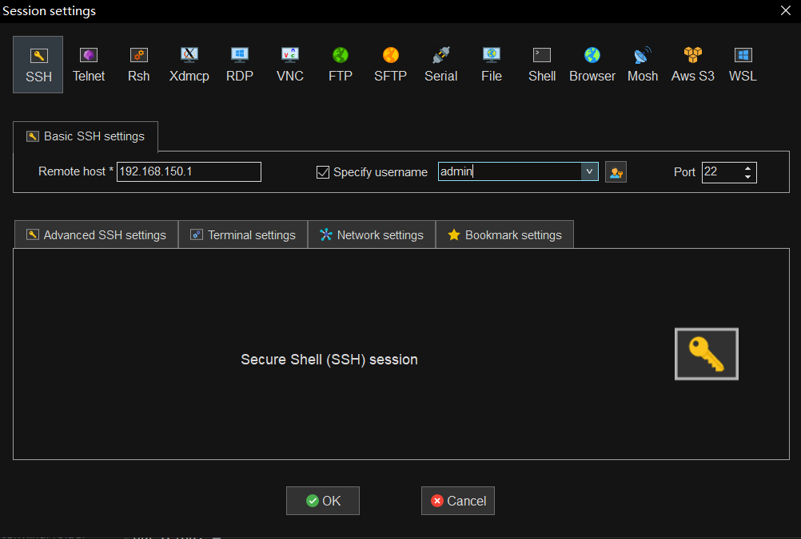
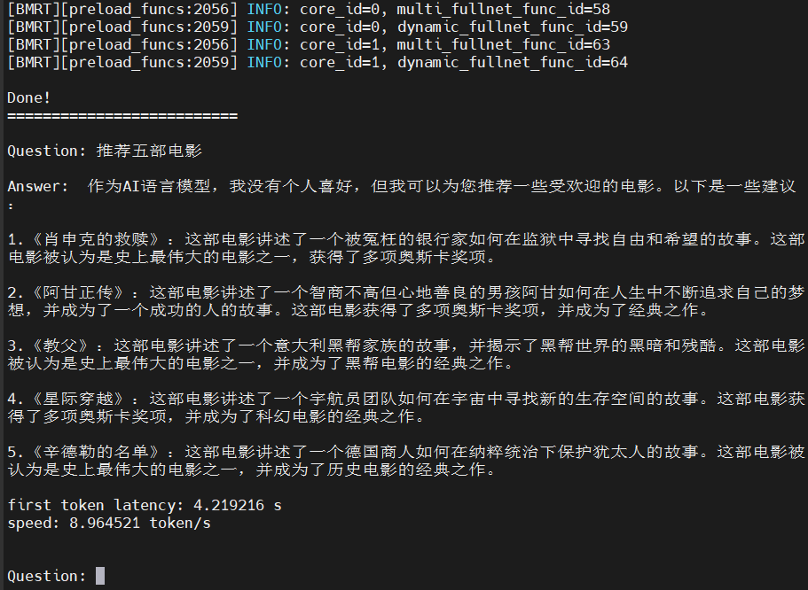
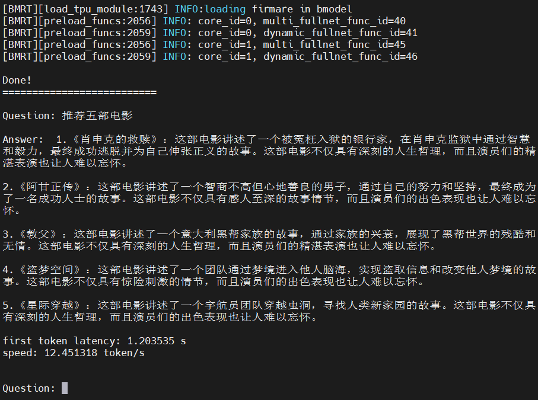

# MiniCPM-2B在BM1688上部署

# 1. 准备模型和链接库
以下步骤在x86主机上进行：
## 1.1 安装、创建并进入docker
- 安装docker
```bash
sudo apt-get install docker.io
```
- 创建一个名为 docker 的用户组。如果该用户组已经存在，这条命令会报错，但可以忽略该错误，因为该用户组已经存在，无需再次创建
```bash
sudo groupadd docker
```
- 将当前用户（$USER 是系统当前用户的环境变量）加入到 docker 用户组。加入该组后，用户可以在不使用 sudo 的情况下运行 Docker 命令
```bash
sudo usermod -aG docker $USER
```
- 这条命令用于切换当前会话的用户组。执行后，当前终端会话会被赋予 docker 组的权限。你可以立即在该终端中执行 Docker 命令，而无需退出并重新登录系统。如果没有使用 newgrp，你需要重新登录或重启才能应用用户组的更改
```bash
newgrp docker
```
- 从 Docker Hub 上拉取名为 sophgo/tpuc_dev 的最新版本的镜像
```bash
docker pull sophgo/tpuc_dev:latest
```
- 运行 Docker 容器，将当前主机目录映射到 Docker 容器内的 /workspace 目录。这样主机上的文件可以在容器内的 /workspace 目录中访问到，方便开发，同时以交互模式运行容器，并将容器的终端连接到你的控制台上
```bash
docker run --privileged --name 容器名称(自拟) -v $PWD:/workspace -it sophgo/tpuc_dev:latest
```
注：再次启动容器：docker start -i 容器名称

## 1.2 下载并解压TPU-MLIR
- 获取TPU-MLIR压缩包
```bash
pip3 install dfss --upgrade
python3 -m dfss --url=open@sophgo.com:sophon-demo/MiniCPM/tpu-mlir_latest.tar.gz
```
- 解压
tar -xzvf tpu-mlir_latest.tar.gz
```

## 1.3 初始化软件环境
- 进入容器内/workspace目录下的/tpu-mlir_vx.y.z-<hash>-<date>路径
```bash
cd /workspace/tpu-mlir_vx.y.z-<hash>-<date>
```
- 初始化开发环境
```bash
source ./envsetup.sh
```
注：`vx.y.z-<hash>-<date>`根据步骤1.2解压得到的文件夹具体名称进行修改

## 1.4 onnx模型导出
下载MiniCPM-2B模型，下载方式:  
1.从huggingface上直接下载:[MiniCPM-2B-sft-bf16](https://huggingface.co/openbmb/MiniCPM-2B-sft-bf16)  
  
2.下载算能提供的模型压缩包并解压
```bash
sudo apt-get update
sudo apt-get install unzip
python3 -m dfss --url=open@sophgo.com:sophon-demo/MiniCPM/MiniCPM-2B-sft-bf16.zip
unzip MiniCPM-2B-sft-bf16.zip
```
使用提供的 `modeling_minicpm.py`文件替换上一步下载的模型中的`modeling_minicpm.py`文件。  

将替换好的 MiniCPM-2B-sft-bf16 文件夹及提供的`requirement.txt`、`export_onnx.py`文件以及`scripts`、`cpp`文件夹移动至`/tpu-mlir_vx.y.z-<hash>-<date>`路径下。 

- 根据`requirement.txt`安装所需依赖
```bash
pip3 install -r requirements.txt
```

- 运行脚本将指定路径下的模型导出为onnx格式，onnx模型将导出至`/scripts/tmp`路径下
```shell
python3 export_onnx.py --model_path MiniCPM-2B-sft-bf16
```
注：模型默认`seq_length=512`，可通过运行脚本时添加`--seq_length`来指定序列长度，例如
```python3 export_onnx.py --model_path ./MiniCPM-2B-sft-bf16/ --seq_length 1024```

## 1.5 bmodel转化
- 进入scripts目录
```bash
cd scripts
```
运行脚本获取bmodel模型
- 单核模型获取(minicpm-2b_bm1688_int4_1core.bmodel）
```shell
./gen_bmodel.sh --name minicpm-2b --mode int4 --target BM1688 --num_core 1
```
- 双核模型获取(minicpm-2b_bm1688_int4_2core.bmodel）
```shell
./gen_bmodel.sh --name minicpm-2b --mode int4 --target BM1688 --num_core 2 
```
最后生成的bmodel位于`/scripts`路径下。

## 1.6 准备tokenizer
tokenizer已提供，位于路径`/cpp/token_config`下，可直接使用。

## 1.7 编译sentencepiece
`llibsentencepiece.a` 主要用于在 C++ 环境中实现子词分割和文本处理，它是 sentencepiece 库的核心静态库，支持将输入文本分割为子词单元。相关的 `libsentencepiece.a`已提供，位于路径`/cpp/lib_soc_bm1688`下，可直接使用。

# 2. 连接BM1688
通过网线连接BM1688上的LAN口和x86主机，修改主机ip为`192.168.150.2`，使用MobaXterm软件进行远程操控，通过SSH进行连接，BM1688的ip为`192.168.150.1`，用户名和密码均为`admin`，将通过上一步骤得到的模型相关文件下载至BM1688上。
  
  


# 3. 例程测试
以下步骤在BM1688上进行：  
## 3.1 程序编译
- 进入cpp目录
```bash
cd cpp
```
- 创建一个名为 build 的目录，用于存放编译过程中生成的中间文件和最终的可执行文件
```bash
mkdir build
```
- 进入build目录
```bash
cd build
```
- 使用 CMake读取上一级目录中的CMakeLists.txt构建系统生成 Makefile 文件。
注：因为实验采用的是 soc BM1688芯片，故将参数设置为 -DTARGET_ARCH=soc_bm1688
```bash
cmake .. -DTARGET_ARCH= soc_bm1688
```
- 编译项目
```bash
make -j
```

## 3.2 例程测试
运行minicpm
- 单核模型
```bash
./minicpm --model ../../models/BM1688/minicpm-2b_bm1688_int4_1core.bmodel --tokenizer ../token_config/tokenizer.model --devid 0
```

-双核模型
```bash
./minicpm --model ../../models/BM1688/minicpm-2b_bm1688_int4_2core.bmodel --tokenizer ../token_config/tokenizer.model --devid 0
```

## 3.3 实验结果
单核模型
- seq_length默认(512)

- seq_length=1024

双核模型
- seq_length默认(512)

- seq_length=1024


<div align='center'>
  
**模型性能表** 
</div>

<div align='center'>
  
| BM1688 | int4_1core | int4_2core | int4_1core(seq_length=1024) | int4_2core(seq_length=1024) |
| :-----------:  | :----------------: | :---------------------------:  | :--------------------: | :-----------------------: |
| first token latency(s) | 2.033 | 1.206 | 4.154 | 2.413 |
| token per second(tokens/s) | 10.420 | 12.487 | 8.961 | 10.980 |
<div align='center'>
